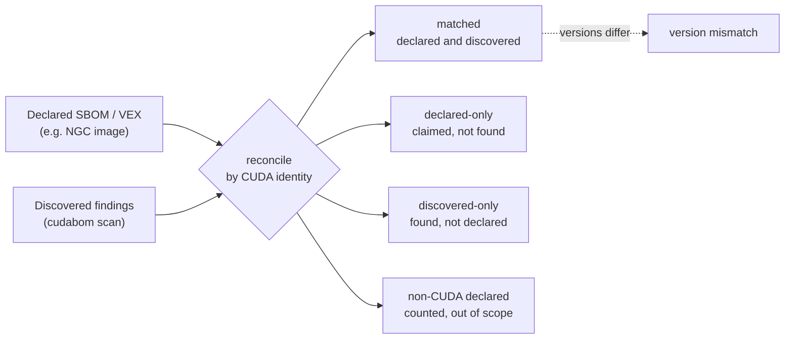

<p align="center">
  
</p>

<!-- BADGES_START - stripped from the Hugo docs build; see .hugo/scripts/build_docs.py -->
<p align="center">
  <a href="https://github.com/cpeoples/cudabom/actions/workflows/ci.yml"></a>&nbsp;&nbsp;
  <a href="https://scorecard.dev/viewer/?uri=github.com/cpeoples/cudabom"></a>&nbsp;&nbsp;
  <a href="https://github.com/cpeoples/cudabom/security/code-scanning"></a>&nbsp;&nbsp;
  <a href="https://github.com/cpeoples/cudabom/actions/workflows/cargo-audit.yml"></a>&nbsp;&nbsp;
  <a href="https://github.com/cpeoples/cudabom/releases/latest"></a>&nbsp;&nbsp;
  <a href="https://github.com/cpeoples/cudabom/releases/latest"></a>&nbsp;&nbsp;
  <a href="https://github.com/cpeoples/cudabom/releases/latest"></a>&nbsp;&nbsp;
  <a href="LICENSE"></a>
</p>
<!-- BADGES_END -->

**Find the CUDA your SBOM missed.**

cudabom is an open-source Rust CLI that proves which NVIDIA CUDA software is
actually inside an artifact (Python wheels, shared libraries, executables, and
container images) and turns that evidence into security-grade SBOM, advisory,
and VEX data.

The question it answers:

> What CUDA is really inside this artifact, how do we know, and are we affected
> by any NVIDIA security bulletin?

### Built with

<p>
  <a href="https://www.rust-lang.org/" title="Rust"></a>
  &nbsp;&nbsp;
  <a href="https://doc.rust-lang.org/cargo/" title="Cargo"></a>
  &nbsp;&nbsp;
  <a href="https://docs.github.com/actions" title="GitHub Actions"></a>
  &nbsp;&nbsp;
  <a href="https://gohugo.io/" title="Hugo"></a>
</p>

> [!NOTE]
> cudabom is an independent project. It is not an NVIDIA product or an official
> NVIDIA security tool, and is not affiliated with NVIDIA. See [`NOTICE`](NOTICE).

> [!WARNING]
> Early development. The analyzer is being built out: `scan`, `gate`, `vex`,
> `enrich`, `reconcile`, `explain`, `db`, `update`, `schema`, and `version` are
> implemented. Fingerprint coverage spans every published CUDA redistributable
> release (11.0 through the current 13.x line); identity coverage continues to
> grow as component profiles are extended.

## What it does (and what it does not)

cudabom scans **compiled, packaged artifacts**, the things you ship or pull
after a build, and tells you which CUDA components are physically inside them.

**It does:**

- Scan **built binaries and packages**: ELF shared libraries and executables
  (`.so`, bare ELF), Python **wheels** (`.whl`), `tar`/`gzip` archives, Unix
  **static libraries** (`.a`, detected and walked), and container-image layer
  tarballs or unpacked layer directories.
- Identify the CUDA inside them (cudart, cuBLAS, cuDNN, NCCL, nvJPEG, and more) by
  **hashes, build-ids, and symbols**: including copies that are **statically
  linked, vendored, or renamed**, which manifest- and source-level scanners miss.
- Correlate each identified version against **NVIDIA's security bulletins** and
  emit SBOM / VEX / SARIF for CI.

**It does not:**

- Read your **source code** (`.cu`, `.cpp`, headers); it does not parse source
  to infer dependencies.
- Read your **dependency manifests** (`requirements.txt`, `Cargo.toml`,
  `environment.yml`); it inspects what the build actually *produced*, not what
  you declared.
- **Run, load, or JIT** anything it scans, and it needs **no GPU**.

### Inputs and outputs

| You give it | It walks | You get back |
|---|---|---|
| `foo.whl` / `.zip` | every ELF inside the archive | identified components + advisories |
| `libcudart.so.12` (bare ELF) | the shared object directly | identity (hash/build-id/soname) + CVEs |
| `libcudart_static.a` | the static archive (detected; member identification is expanding) | embedded-CUDA findings as coverage grows |
| image layer `.tar`/`.tar.gz` | files inside the layer | per-file CUDA findings |
| a directory | files under it (bounded) | aggregate findings |

Output formats (`--format`): `table` (human), `json` (native), `cyclonedx`
(SBOM), `sarif` (code scanning), `markdown` (PR comment). Any of them to a file
with `-o`.

### Why not source parsing?

Deliberate scope, not a missing feature. cudabom's thesis is **evidence over
declaration**: what you *write* (source) and *declare* (manifests) routinely
disagrees with what actually lands in the shipped binary. Source says
**intent**; the artifact tells the **truth**.

- `-lcublas` in a build, or `import torch` in a `.py`, tells you something was
  *meant* to link, not which version shipped, whether it was statically baked
  in, dead-stripped out, or whether a transitive dependency vendored a different
  copy. A renamed/vendored `libcudart` embedded in a third-party `.so` has **no
  source footprint in your repo at all**; only binary evidence finds it.
- Source and lockfile analysis is also environment-dependent (toolchain, flags,
  platform), which would break cudabom's deterministic, reproducible output.

Source- and manifest-level dependency discovery is already well served by SCA
tooling (Dependabot, `pip-audit`, Trivy's lockfile scanners). cudabom is the
**complement**: it answers "what's really in the artifact," and
[`cudabom reconcile`](#see-it-work-end-to-end) proves whether that agrees with
what a source/manifest-derived SBOM declared. The adjacent extension that stays
true to the model is ingesting *more declaration formats to reconcile against*
(it already reads PEP 770 / CycloneDX), never guessing dependencies from source.

## Start here

Pick the command that matches your goal:

| Your goal | Command |
|---|---|
| "What CUDA is in this artifact, and am I affected?" | `cudabom scan <artifact> --advisories <index>` |
| "Fail my CI build if an identified CUDA is affected" | `cudabom scan <artifact> --fail-on affected` (or [`cudabom gate --policy`](docs/policy.md)) |
| "Produce an SBOM / VEX / SARIF for this artifact" | `cudabom scan ... --format cyclonedx` / `cudabom vex ...` / `cudabom scan ... --format sarif` |
| "Add the CUDA my existing SBOM missed" | `cudabom enrich --sbom in.cdx.json <artifact> -o out.cdx.json` |
| "Does what the vendor declared match what's really inside?" | `cudabom reconcile <artifact> --sbom declared.cdx.json` |
| "Why did it identify this?" | `cudabom explain <finding-id>` |
| "Install / refresh the fingerprint + advisory data" | `cudabom update` |

The 60-second first run is in [See it work end to end](#see-it-work-end-to-end)
below; CI wiring is in
[Generating the report artifacts in CI](#generating-the-report-artifacts-in-ci).

## What makes it specific

General binary and native-dependency discovery already exists: Syft has ELF
catalogers, Trivy consumes and produces SBOMs, and OWASP blint does symbol- and
fingerprint-based native identification. cudabom does **not** claim those tools
cannot find dependencies in binaries. It specializes where they are
general-purpose:

1. **CUDA component identity**: cudart, cuBLAS/cuBLASLt, cuDNN, NCCL, and more
   over time, including **statically linked** and **vendored/renamed** copies.
2. An explicit **evidence model** with EXACT / LIKELY / UNKNOWN confidence.
3. Correlation against **NVIDIA's machine-readable security bulletins** (CSAF).
4. **Enriching** existing Syft/Trivy/PEP 770 SBOMs rather than replacing them.
5. **GPU code awareness**: fatbins, embedded PTX/SASS, SM targets, and
   producer/toolchain metadata.
6. **Declared vs. discovered** reconciliation: what a wheel's PEP 770 SBOM says
   vs. what cudabom finds.

A fair, verified comparison table against Syft, Trivy, and blint lives in
[`docs/comparison.md`](docs/comparison.md), measured by actually running them
(`cargo xtask eval`); the summary is under [Documentation](#documentation).

## Design principles

- **No GPU required, runs on any CI runner.** cudabom reads and analyzes
  artifacts on the CPU; it never runs code on a GPU.
- **Never executes what it scans.** No `dlopen`, no JIT, and no network except
  the explicit data-refresh commands (`cudabom update`, `cudabom db update`).
  All crates build under `#![forbid(unsafe_code)]`. See
  [`docs/threat-model.md`](docs/threat-model.md).
- **Never asserts more than the evidence supports.** A confident wrong answer is
  worse than "unknown". See [`docs/evidence-model.md`](docs/evidence-model.md).
- **Deterministic output**, so diffs and snapshots are meaningful.

## Install

Once a release is published, `cudabom` is available from several official
channels. Each drops the same `cudabom` executable on your `PATH`:

```bash
cargo install cudabom                     # crates.io
brew install cpeoples/tap/cudabom         # Homebrew
snap install cudabom                      # Snap Store
pip install cudabom                       # PyPI (also: uvx cudabom)
```

Prebuilt, Sigstore-signed binaries for Linux, macOS, and Windows are attached
to each [GitHub Release](https://github.com/cpeoples/cudabom/releases).

## Quickstart

Build from source (the toolchain is pinned in
[`rust-toolchain.toml`](rust-toolchain.toml)):

```bash
git clone https://github.com/cpeoples/cudabom.git
cd cudabom
cargo build --release
./target/release/cudabom version --verbose
```

Command surface (crate and pipeline architecture in [`docs/architecture.md`](docs/architecture.md)):

```bash
cudabom scan <target>... --format table|json|cyclonedx|sarif|markdown [--fail-on none|found|affected]
cudabom gate <target>... --policy policy.json
cudabom enrich --sbom input.cdx.json <target> -o output.cdx.json
cudabom vex <target> -o vex.cdx.json
cudabom reconcile <target>... --sbom declared.cdx.json --vex declared.vex.json
cudabom explain <finding-id>
cudabom update
cudabom db update | db status | db build
cudabom schema
cudabom version --verbose
```

Exit codes: `0` success, `1` policy violation (`gate`) or `scan --fail-on`
threshold met, `2` usage error, `3` input error, `4` internal error. A plain
`scan` is a reporting command and exits `0` even when it identifies CUDA or
finds affected advisories; opt into failure with `--fail-on found` (any CUDA
identified) or `--fail-on affected` (an advisory affects an identified version),
or use `gate` for full policy enforcement.

## See it work end to end

<p align="center">
  
</p>

The chain, on a real NVIDIA library. cudabom independently fingerprints a
`.so`, identifies it, correlates it to CVEs, and reconciles it against a
declared SBOM. From a clone (pointing at the committed data):

```bash
# 1. Identify + correlate to NVIDIA advisories.
cudabom scan libnvjpeg.so.11.5.2.120 \
  --db fingerprints/cuda --advisories advisories/index.json
```

```text
findings:
  [Exact] nvjpeg 11.5.2.120 (EmbeddedCopy) <- 1 evidence: KnownFileHash
composition:
  contains nvjpeg 11.5.2.120  advisories: not_affected(CVE-2023-31028),
    affected(CVE-2024-0142), affected(CVE-2024-0143), ... affected(CVE-2025-23275)
advisories:
  summary: 12 affected (2 high, 7 medium, 3 low), 1 not affected, 0 under investigation
  most severe: CVE-2025-23275 nvjpeg (HIGH CVSS 7.5)
  HIGH (2):
    CVE-2025-23275  CVSS 7.5  2025-09-23  https://nvd.nist.gov/vuln/detail/CVE-2025-23275
    ...
  MEDIUM (7):
    CVE-2024-0142  CVSS 6.8  2025-02-11  https://nvd.nist.gov/vuln/detail/CVE-2024-0142
    ...
```

The `[Exact]` identity is evidence-backed: its SHA-256 matched a fingerprint
derived from NVIDIA's own archive. Advisory verdicts are version-range decisions
(`CVE-2023-31028` is correctly ruled `not_affected`), and the result leads with a
severity breakdown and the most severe CVE, grouping affected advisories
highest-severity-first with CVSS, date, and link. On a multi-file artifact the
`table` listing leads with the files that carry a CUDA signal and collapses the
rest into `... and N other file(s)` (`--all-files` shows everything; `-v` adds
per-advisory detail). The same scan emits CycloneDX (`--format cyclonedx`), SARIF
(`--format sarif`), or a VEX document (`cudabom vex`).

Reconcile what a vendor **declares** against what cudabom **discovers**:

```bash
# 2. Declared (e.g. an NGC image SBOM/VEX) vs. discovered.
cudabom reconcile libcudart.so.12.4.127 libcublas.so.11.6.5.2 libnvjpeg.so.11.5.2.120 \
  --db fingerprints/cuda \
  --sbom fixtures/ngc/sbom.cyclonedx.json --vex fixtures/ngc/vex.cyclonedx.json
```

```text
reconciliation: 2 matched, 0 declared-only, 1 discovered-only (1 non-CUDA declared)

discovered but NOT declared (declaration under-reports):
  + nvjpeg 11.5.2.120        # the CUDA the SBOM missed
matched:
  = cublas 11.6.5.2 (version mismatch: declared 12.4.5.8)
  = cudart 12.4.127
      vex: not_affected CVE-2025-23248   # the declaration's VEX rides along
```

Reconciliation compares by canonical CUDA identity (so `cuda-cudart`,
`libcudart.so.12`, and `pkg:generic/cuda-cudart@...` all line up with `cudart`),
then sorts each component into one bucket:



`cudabom reconcile --ngc-image <org/repo:tag>` fetches the declared documents
straight from NGC (opt-in, key-gated) instead of local files.

**Enrich an existing SBOM** instead of replacing it. `enrich` keeps the input
document byte-for-byte (including fields cudabom does not model) and only adds
the CUDA components it discovered that the SBOM was missing, reporting the delta
on stderr:

```bash
cudabom enrich --sbom syft.cdx.json libnvjpeg.so.11.5.2.120 \
  --db fingerprints/cuda -o enriched.cdx.json
# cudabom: enriched SBOM (+1 component(s), 3 already present)
```

**Emit a VEX document** (CycloneDX 1.6) carrying the advisory verdicts as VEX
`analysis.state` statements, so a consumer sees which CVEs apply and which were
ruled out:

```bash
cudabom vex libnvjpeg.so.11.5.2.120 \
  --db fingerprints/cuda --advisories advisories/index.json -o vex.cdx.json
```

**Validate native JSON output** against the published schema. `cudabom schema`
prints the JSON Schema for `--format json`, keyed by schema version so a
consumer can branch on it:

```bash
cudabom schema
```

```json
{
  "$schema": "https://json-schema.org/draft/2020-12/schema",
  "$id": "https://cpeoples.github.io/cudabom/schema/0.1.0/cudabom.schema.json",
  "title": "cudabom native output",
  "type": "object",
  "properties": { "schemaVersion": { "type": "string", "const": "0.1.0" } },
  "required": ["schemaVersion"]
}
```

The `.so` files above come from NVIDIA's redistributables; the committed
lockfiles under `fingerprints/` describe exactly which archives to fetch, and
`cargo xtask corpus fetch` retrieves and verifies them.

### Generating the report artifacts in CI

cudabom has no single "report file": the report *is* the command output in the
format you request. A typical CI step produces the security artifacts and gates
the build in one place:

```bash
# Machine-readable deliverables (write to files with -o):
cudabom scan "$ARTIFACT" --db "$DB" --advisories "$ADV" --format cyclonedx -o sbom.cdx.json
cudabom vex  "$ARTIFACT" --db "$DB" --advisories "$ADV"                     -o vex.cdx.json
cudabom scan "$ARTIFACT" --db "$DB" --advisories "$ADV" --format sarif      -o cudabom.sarif

# Gate the build: exit non-zero only when an advisory affects an identified version.
cudabom scan "$ARTIFACT" --db "$DB" --advisories "$ADV" --fail-on affected
```

Upload `cudabom.sarif` to code scanning, attach `sbom.cdx.json` / `vex.cdx.json`
as build artifacts, and the `--fail-on affected` step decides pass/fail. For
policy beyond a single threshold (severity floors, component allow/deny), use
`cudabom gate --policy policy.json` (schema in [`docs/policy.md`](docs/policy.md)).

## Getting the data

cudabom ships as a single binary that carries **no** fingerprint database or
advisory index: those are versioned, reviewed data published per release. A
binary-only install (crates.io, a Snap, a release archive) fetches them with:

```bash
cudabom update            # install the latest release's data bundle
cudabom update --tag v1.2.3   # or pin a specific release
cudabom version --verbose     # confirm what is installed
```

`update` downloads the signed `cudabom-data-<tag>.tar.gz` from the project's
GitHub Releases, verifies it against its `.sha256` sidecar, and unpacks it into
a per-user data directory, resolved in this order:

1. `CUDABOM_DATA_DIR`: explicit override.
2. `SNAP_USER_DATA/cudabom`: inside a confined Snap.
3. `XDG_DATA_HOME/cudabom`: the freedesktop base dir.
4. `~/.local/share/cudabom`: the default.

Once installed, `scan`, `gate`, `vex`, `enrich`, `reconcile`, and `explain`
default their `--db` and `--advisories` to this directory, so no flags are
needed; pass `--db`/`--advisories` (or `--data-dir` on `update`) to override.
Working from a clone instead? Point `--db fingerprints/cuda` and
`--advisories advisories/index.json` at the committed data directly.

## Project layout

```
crates/
  cudabom/           clap front end, output selection, exit codes
  cudabom-core/      shared types: Artifact, Location, Component, Evidence,
                     Confidence, Finding, and tunable safety Limits
  cudabom-extract/   safe archive/container/wheel walkers with nesting limits
  cudabom-elf/       ELF facts: SONAME, NEEDED, symbols, build-id, sections
  cudabom-fatbin/    fatbin/cubin/PTX parsing
  cudabom-identify/  fingerprint DB + matchers -> CUDA identities + confidence
  cudabom-advisory/  NVIDIA CSAF ingestion, normalization, matching
  cudabom-sbom/      CycloneDX emit/enrich/merge, PEP 770 reader, VEX
  cudabom-report/    table, JSON, SARIF, Markdown renderers
  cudabom-policy/    policy evaluation for `gate`
xtask/               fixture builds, fingerprint-DB builder, corpus evaluation
fingerprints/        versioned fingerprint data (derived data only, no binaries)
fixtures/            CUDA C++ test-fixture sources (compiled artifacts are not committed)
fuzz/                fuzz targets for every parser
docs/                architecture, evidence model, advisories, threat model
```

## Configuration

Tunables are centralized so there are no scattered magic values:

| Concern | Where |
|---|---|
| Dependency versions, lint policy | root [`Cargo.toml`](Cargo.toml) |
| Code formatting | [`rustfmt.toml`](rustfmt.toml) |
| Clippy thresholds | [`clippy.toml`](clippy.toml) |
| Supply-chain policy (licenses, advisories, bans) | [`deny.toml`](deny.toml) |
| Runtime safety limits (nesting, byte caps, ratios, timeouts) | `crates/cudabom-core/src/config.rs` |

## Security

cudabom parses attacker-controlled files, so it holds itself to a high bar:
`#![forbid(unsafe_code)]`, panic-free parsers, bounded extraction, SHA-pinned
GitHub Actions on hardened runners, cargo-audit and cargo-deny gates, CodeQL,
and OpenSSF Scorecard. Report vulnerabilities via a private advisory; see
[`SECURITY.md`](SECURITY.md).

## Documentation

The long-form documentation lives in [`docs/`](docs/) as standalone Markdown;
GitHub renders it inline, and the full documentation site (Hugo + the Relearn
theme, served at GitHub Pages) presents the same content with a navigation
sidebar and search.

| Topic | Source |
|---|---|
| CLI reference (commands, formats, exit codes) | [`docs/cli.md`](docs/cli.md) |
| Architecture (crates, pipeline, invariants) | [`docs/architecture.md`](docs/architecture.md) |
| Evidence and confidence model | [`docs/evidence-model.md`](docs/evidence-model.md) |
| Gate policy schema | [`docs/policy.md`](docs/policy.md) |
| Advisory ingestion and correlation | [`docs/advisories.md`](docs/advisories.md) |
| Data sources and provenance | [`docs/sources.md`](docs/sources.md) |
| Measured comparison vs. blint / Syft / Trivy (accuracy + speed) | [`docs/comparison.md`](docs/comparison.md) |
| Benchmarks (how performance is measured, head to head) | [`docs/benchmarks.md`](docs/benchmarks.md) |
| Threat model | [`docs/threat-model.md`](docs/threat-model.md) |

The site is generated from `docs/*.md` plus data-driven pages: CUDA coverage
(from the fingerprint database), advisory coverage (from the advisory index),
and a CLI reference (from `cudabom --help`), by
[`.hugo/scripts/build_docs.py`](.hugo/scripts/build_docs.py), then built and
deployed by [`.github/workflows/docs.yml`](.github/workflows/docs.yml) on every
push to `main`.

Preview it locally:

```bash
git submodule update --init    # fetch the Relearn theme (first time only)
cargo build --release          # so the generated CLI reference matches the binary
python .hugo/scripts/build_docs.py
hugo server -s .hugo
```

### How does cudabom compare to blint, Syft, and Trivy?

[`docs/comparison.md`](docs/comparison.md) runs each tool through its own CLI on
the same real artifacts and records what each reports, regenerated by
`cargo xtask eval --write-comparison`. In short: blint surfaces the `cudart`
soname but pins no release and no CVE; Syft and Trivy report nothing for a bare
shared object; cudabom closes the last mile from build-id/hash to exact CUDA
version to CVE correlation. It is authoritative for CUDA identity specifically,
and complements rather than replaces general SBOM and OS-package scanners.

## Contributing

See [`CONTRIBUTING.md`](CONTRIBUTING.md) for the dev setup, the quality gates,
and how to add a fingerprint or an output format.

## License

Apache-2.0. See [`LICENSE`](LICENSE) and [`NOTICE`](NOTICE).
